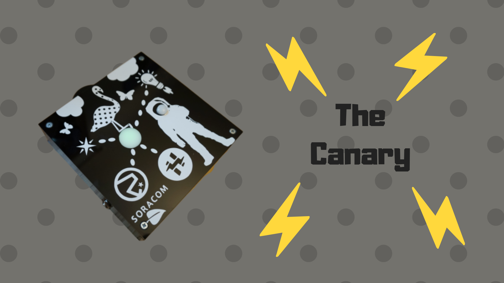

# The Canary: A Portable Air Quality Monitor



This branch is the code for the Canary which enables you to monitor humidity, temperature, air particulates, eC02 and TVOCs using. The Canary is ready for LTE and can be used specifically with a Particle Boron. [For more information click here.](https://www.hackster.io/jaredwolff/the-canary-a-portable-air-quality-monitor-99a1f4)

[Looking to buy a Particle Squared? Go here.](https://www.jaredwolff.com/store/particle-squared/)

## Quick Start:

1. Clone this repo onto a place on your machine: `git clone git@bitbucket.org:circuitdojo/particle-squared-code.git`
2. Checkout the `workplace-monitor` branch
3. Open the repo with Visual Code: (`code .` using the command line, or `file`->`open`)
4. Open `/src/particle-squared.ino`
5. Select your target device in the lower bar (Options are `xenon`, `argon`, `boron`) (Note: tested and working with `boron`)
6. Hit `cmd` + `shift` + `p` to get the command menu
7. Select `Compile application (local)`. You can also choose `Cloud flash` as long as `board.h` has not been modified.
8. Enjoy playing around with the code!

## SORACOM + Boron

As of this writing, Boron does not support SORACOM out of the box. A few AT commands must be put before powering up the modem. Follow the setup below to get everything working:

1. Clear your credentials and set the external SIM (if you haven't already)

    Cellular.setActiveSim(EXTERNAL_SIM);
    Cellular.clearCredentials();

2. Then, when you wan to connect run these few commands.

    Cellular.on();
    Cellular.command("AT+CGDCONT=2,\"IP\",\"\"","soracom.io");
    Cellular.command("AT+UAUTHREQ=2,%d,\"%s\",\"%s\"",2,"sora","sora");

3. Make sure that the device is in SEMI_AUTOMATIC mode.

    SYSTEM_MODE(SEMI_AUTOMATIC);

This allows for successful PPP authentication with SORACOM's APN. For an official fix, check [this push request](https://github.com/particle-iot/device-os/pull/1798) for more info.

## Particle Basics

#### ```/src``` folder:
This is the source folder that contains the firmware files for your project. It should *not* be renamed.
Anything that is in this folder when you compile your project will be sent to our compile service and compiled into a firmware binary for the Particle device that you have targeted.

If your application contains multiple files, they should all be included in the `src` folder. If your firmware depends on Particle libraries, those dependencies are specified in the `project.properties` file referenced below.

#### ```.ino``` file:
This file is the firmware that will run as the primary application on your Particle device. It contains a `setup()` and `loop()` function, and can be written in Wiring or C/C++. For more information about using the Particle firmware API to create firmware for your Particle device, refer to the [Firmware Reference](https://docs.particle.io/reference/firmware/) section of the Particle documentation.

#### ```project.properties``` file:
This is the file that specifies the name and version number of the libraries that your project depends on. Dependencies are added automatically to your `project.properties` file when you add a library to a project using the `particle library add` command in the CLI or add a library in the Desktop IDE.

## Adding additional files to your project

#### Projects with multiple sources
If you would like add additional files to your application, they should be added to the `/src` folder. All files in the `/src` folder will be sent to the Particle Cloud to produce a compiled binary.

#### Projects with external libraries
If your project includes a library that has not been registered in the Particle libraries system, you should create a new folder named `/lib/<libraryname>/src` under `/<project dir>` and add the `.h`, `.cpp` & `library.properties` files for your library there. Read the [Firmware Libraries guide](https://docs.particle.io/guide/tools-and-features/libraries/) for more details on how to develop libraries. Note that all contents of the `/lib` folder and subfolders will also be sent to the Cloud for compilation.

## Compiling your project

When you're ready to compile your project, make sure you have the correct Particle device target selected and run `particle compile <platform>` in the CLI or click the Compile button in the Desktop IDE. The following files in your project folder will be sent to the compile service:

- Everything in the `/src` folder, including your `.ino` application file
- The `project.properties` file for your project
- Any libraries stored under `lib/<libraryname>/src`

## License

See included `LICENSE` file.